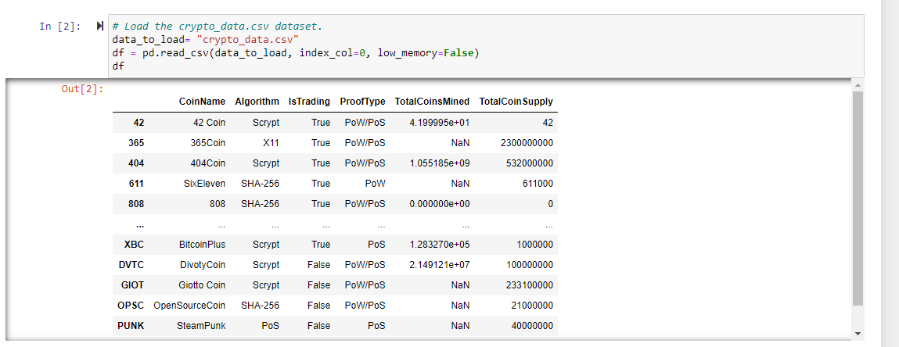
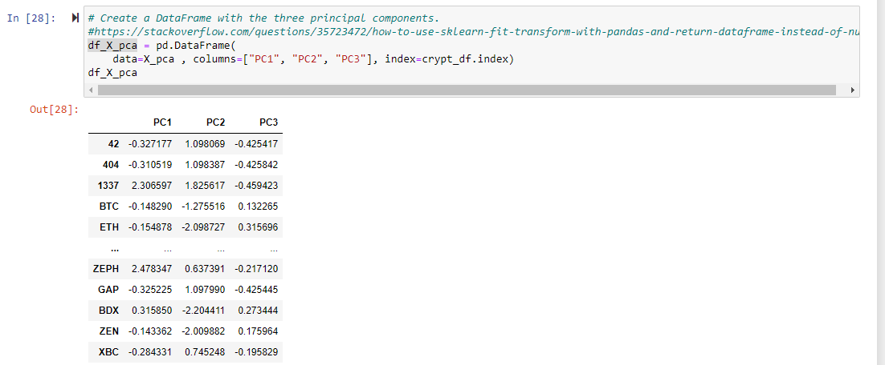
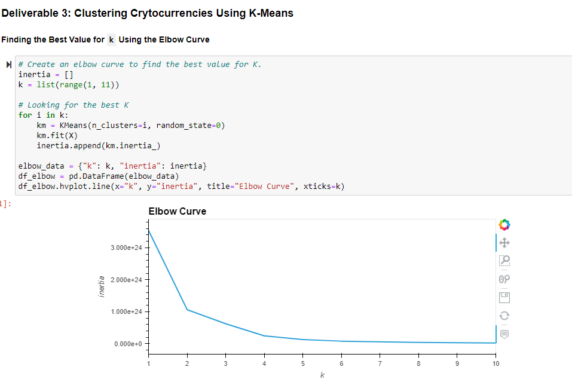
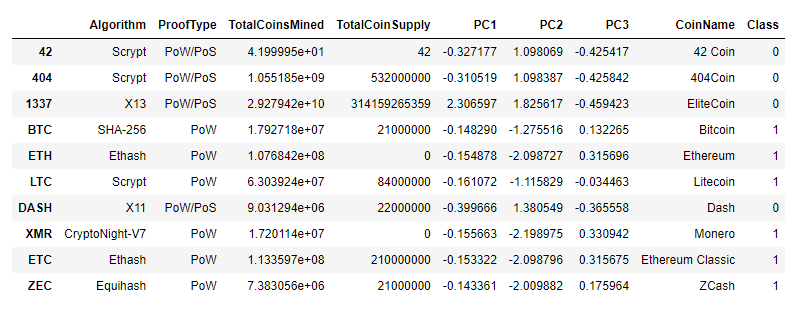
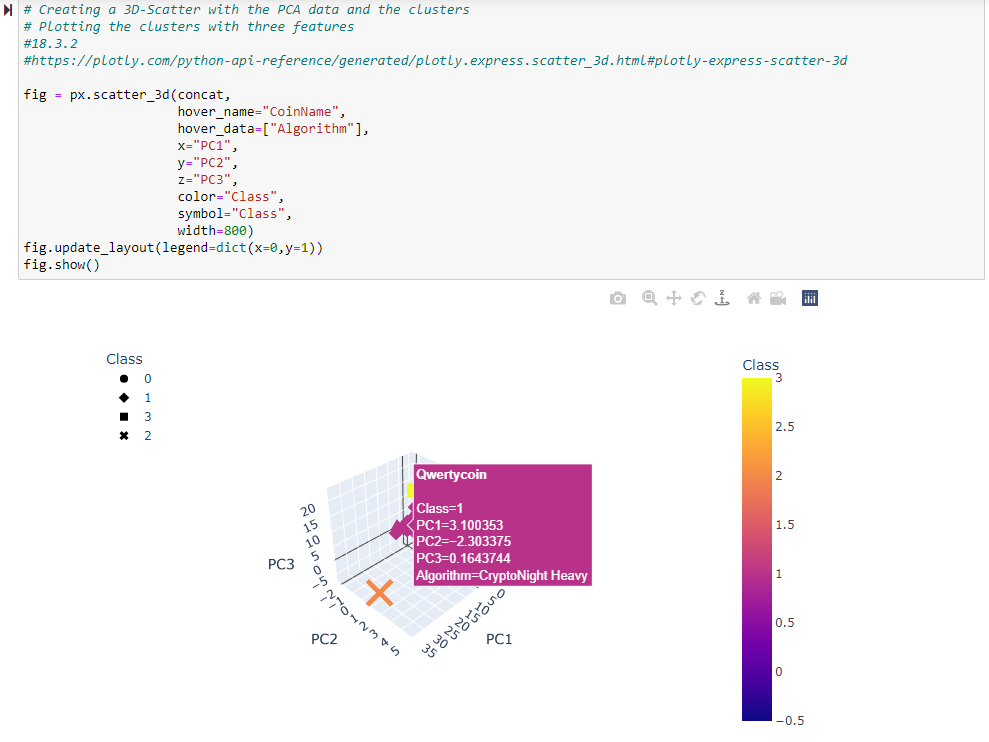
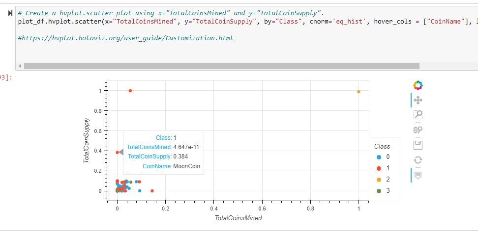

# Cryptocurrencies

## Purpose
Martha who works on the Advisory Services Team at Accountability Accounting which is one my my supposed clients wants to branch off into cryptocurrencies and is not sure how to evaluate cryptocurrencies to invest.
I need to provide sume data using PCA, K-means, and then presenting 2-d and 3-d scatter plots showing where each cryptocurrency lies.

## Actions Taken

### Deliverable 1
 

The first action I had to take was preparing the data.
This meant frist removing any cryptocurrency which is not being traded, then only using those with algorithms, dropping any null values, then convert the algorithm and proof type into individual columns.
This meant converting the data into a boolean type of data where if it was the specific type of each using the get_dummie, so that it would be a value of 1 versus 0. This is to prepare for a visualization.
I also had to remove the trading column as this was the only data available and create a frame with only the names of the cryptocurrencies to use as an index in a later table.
### Deliverable 2
 

Next I had to reduce data dimensions using pca.
PCA is statistcal technique to speed up algorithms when there are too many input features.
Using the previous frame of the name of the cryptocurrencies I was able to tie the index to my new table.

### Deliverable 3
 

Then I had to using clustering to create an elbow curve to see how many clusters I wanted to use.

### Deliverable 4
 

From there I created a prediction model and added the PCA with the other data from deliverable 1.

 

This allowed me to plot a 3-d graph showing where each cryptocurrency lies. I added a hover graph that shows details from the table.

 

Then I scaled the data using MinMaxScaler().fit_transform() to view total coin supply versus the total coins mined and plotted into a scatter plot with the ability to hover and see the coin name along with other details.

